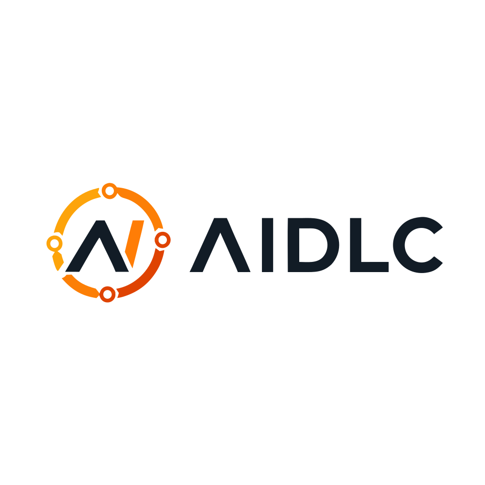

<p align="center">
  
</p>

<h1 align="center">AIDLC</h1>
<p align="center"><strong>AI-Powered SDLC Platform</strong></p>

<p align="center">
  Requirements → tests → review → release → monitoring — in one workspace, with AI at every stage.
</p>

<p align="center">
  
  
  
  
  
  
</p>

<p align="center">
  <a href="#quick-start">Quick Start</a> ·
  <a href="#deployment">Deployment</a> ·
  <a href="https://github.com/WayamAI/AIDLC-Azure">GitHub</a>
</p>

---

## Overview

**AIDLC** (by [WayamAI](https://github.com/WayamAI)) embeds AI across the software delivery lifecycle: requirement analysis, test generation, code review, defect prediction, release gating, and production monitoring.

```
┌──────────────────────────────────────────────────────────────┐
│  Frontend  React 18 + Vite + shadcn/ui            :8080      │
│  Dashboard · Pipeline · AI Workspace · IMCC modules          │
└────────────────────────────┬─────────────────────────────────┘
                             │  /api/*
┌────────────────────────────▼─────────────────────────────────┐
│  Backend  FastAPI + Motor                         :8000      │
│  Auth · Orgs · Test Gen · GitHub · Healing · RCA             │
└────────────────────────────┬─────────────────────────────────┘
                             │
         ┌───────────────────┼───────────────────┐
         ▼                   ▼                   ▼
     MongoDB              Ollama AI         GitHub / Jira
```

---

## Features

### Core workflow
| Module | Description |
|--------|-------------|
| **Requirements → Tests** | Analyze requirements and auto-generate structured test suites |
| **Synthetic Data** | Generate realistic datasets for test scenarios |
| **Test Execution** | Run and track suite results |
| **Risk Ranking** | Prioritize tests and defects by impact |

### Intelligence (IMCC)
| Module | Description |
|--------|-------------|
| **Self-Healing Tests** | Detect flaky selectors and propose healed locators |
| **Root Cause Analysis** | AI-assisted failure diagnosis from logs and diffs |
| **Intelligent Test Selection** | Pick the smallest high-value regression set for a change |
| **CI Intelligence** | Workflow health, flaky detection, failure explanation |
| **Defect Prediction** | File-level risk from commit history |

### Build & ship
| Module | Description |
|--------|-------------|
| **AI Workspace** | Monaco editor, Copilot, Git ops, impact graphs |
| **AI App Builder** | Generate React apps from natural language |
| **Code Reviewer** | AI PR review via GitHub |
| **Release Gate** | Go / no-go decisions with evidence |
| **Auth & Orgs** | WorkOS sessions with multi-tenant isolation |

---

## Quick Start

### Prerequisites

| Tool | Version |
|------|---------|
| Python | 3.12+ |
| Node.js | 18+ |
| MongoDB | 7+ (Docker recommended) |
| Ollama | Local or [Ollama Cloud](https://ollama.com) |

### 1. Clone

```bash
git clone https://github.com/WayamAI/AIDLC-Azure.git
cd AIDLC-Azure
```

### 2. MongoDB

```bash
docker run -d --name aidlc-mongo -p 27017:27017 -v aidlc-mongo-data:/data/db mongo:7
# later: docker start aidlc-mongo
```

### 3. Backend

```bash
cd backend
cp .env.example .env
# Set MONGODB_URI, OLLAMA_*, SESSION_SECRET (and WorkOS keys if using auth)

python -m venv .venv
# Windows:  .venv\Scripts\activate
# macOS/Linux: source .venv/bin/activate

pip install -r requirements.txt
uvicorn main:app --host 127.0.0.1 --port 8000 --reload
```

API docs: [http://127.0.0.1:8000/docs](http://127.0.0.1:8000/docs)  
Health: `GET /health` · Ready: `GET /ready`

> **Port 8000 busy?** Use `uvicorn ... --port 8001` and start the frontend with `BACKEND_PORT=8001 npm run dev`.

### 4. Frontend

```bash
cd frontend
cp .env.example .env
npm install
npm run dev
```

Open [http://localhost:8080](http://localhost:8080) — Vite proxies `/api` to the backend.

---

## Environment Variables

### Backend (`backend/.env`)

| Variable | Required | Description |
|----------|----------|-------------|
| `MONGODB_URI` | Yes | MongoDB / Atlas / Cosmos connection string |
| `MONGODB_DB` | Yes | Database name (default `aidlc`) |
| `SESSION_SECRET` | Yes (prod) | Strong random secret (≥32 chars in production) |
| `OLLAMA_BASE_URL` | For AI | `http://localhost:11434` or `https://ollama.com` |
| `OLLAMA_API_KEY` | For AI | Ollama Cloud API key |
| `OLLAMA_MODEL` | For AI | e.g. `gpt-oss:120b`, `kimi-k3:cloud` |
| `WORKOS_*` | Auth | WorkOS API key, client ID, redirect URI, webhook secret |
| `FRONTEND_URL` / `CORS_ORIGINS` | Prod | Frontend origin(s) for cookies and CORS |
| `GITHUB_TOKEN` | Optional | Private repos & higher rate limits |
| `JIRA_*` / `VERCEL_*` / `SLACK_*` / `DATADOG_*` | Optional | Integrations |

Full templates: `backend/.env.example`, `backend/.env.azure.example`.

---

## Project Structure

```
AIDLC-Azure/
├── backend/                 # FastAPI API
│   ├── app/
│   │   ├── auth/            # WorkOS sessions & dependencies
│   │   ├── routes/          # REST endpoints
│   │   ├── services/        # Business logic & integrations
│   │   ├── engines/         # AI test-generation pipeline
│   │   └── models/          # Pydantic / DB models
│   ├── tests/               # Pytest suite
│   ├── Dockerfile           # API container (Playwright + Chromium)
│   └── main.py
├── frontend/                # Vite + React SPA
│   ├── src/pages/           # Route-level views
│   ├── src/components/      # shadcn/ui + IMCC UI
│   └── src/lib/             # API client, design system, brand
├── infra/azure/             # ACR + Container Apps deploy scripts
├── api/index.py             # Optional Vercel serverless entry
├── Dockerfile               # Unified SPA + API image
├── SETUP.md                 # Detailed local setup
└── VERCEL_DEPLOY.md         # Optional Vercel path
```

---

## Tech Stack

**Frontend:** React 18 · TypeScript · Vite · Tailwind · shadcn/ui · TanStack Query · Monaco · Sigma.js  

**Backend:** FastAPI · Motor (async MongoDB) · Pydantic v2 · Ollama-compatible LLM · Playwright · WorkOS  

**Deploy:** Azure Container Apps + ACR (primary) · optional Vercel · Docker

---

## Scripts

```bash
# Frontend
cd frontend && npm run dev       # :8080
cd frontend && npm run build
cd frontend && npm test

# Backend
cd backend && uvicorn main:app --reload --port 8000
cd backend && pytest
```

---

## Deployment

### Azure Container Apps (recommended)

Long-lived API with Playwright and AI jobs — not Functions.

```powershell
# 1. Configure secrets
cd backend
cp .env.azure.example .env.azure
# Fill MONGODB_URI, SESSION_SECRET, OLLAMA_*, FRONTEND_URL, CORS_ORIGINS, ...

# 2. Deploy
cd ../infra/azure
.\deploy.ps1 -ResourceGroup aidlc-rg -Location eastus
```

Linux/macOS: `./deploy.sh` (see [`infra/azure/README.md`](./infra/azure/README.md)).

| Resource | Default name |
|----------|----------------|
| Resource group | `aidlc-rg` |
| ACR | `aidlcregistry` |
| Container App | `aidlc-api` |

Probes: `GET /health` (liveness), `GET /ready` (Mongo).

Serve the SPA via Azure Static Web Apps (or any static host) and point `FRONTEND_URL` / `CORS_ORIGINS` at that origin.

VM + PM2 fallback: [`frontend/DEPLOY_AZURE_VM.md`](./frontend/DEPLOY_AZURE_VM.md).

### Vercel (optional)

Full-stack import with root `vercel.json`. Required env: `MONGODB_URI`, `OLLAMA_*`. Guide: [`VERCEL_DEPLOY.md`](./VERCEL_DEPLOY.md).

> Live Playwright and AI IDE WebSockets need a container or VM, not serverless alone.

---

## Contributing

1. Fork [WayamAI/AIDLC-Azure](https://github.com/WayamAI/AIDLC-Azure)
2. Create a branch: `git checkout -b feature/my-feature`
3. Commit and open a PR against `main`

---

## License

Proprietary © [WayamAI](https://github.com/WayamAI). All rights reserved.

---

<p align="center">
  <sub>Built by the WayamAI team</sub>
</p>
